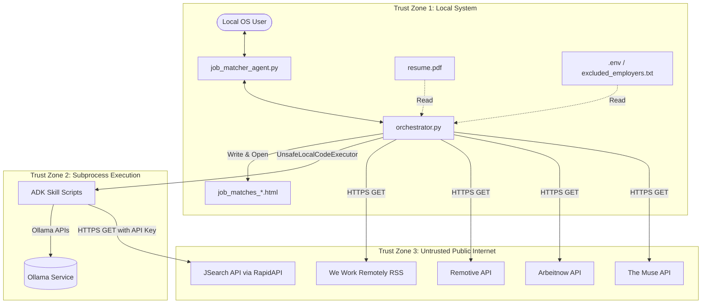

# STRIDE Threat Model Assessment: ATS Job Matcher & Scoring System

This document provides a systematic threat modeling assessment for the **ATS Remote Job Matcher & Scoring System** codebase, using the **STRIDE** methodology.

---

## 1. System Architecture & Boundaries

The ATS Job Matcher is a local Python-based command-line tool that orchestrates remote job crawling, salary filtering, resume parsing, ATS suitability rating, and reporting.

### Trust Zones & System Boundaries

### Entry Points & Data Flows
1. **Command Line Interface (CLI)**: Accept user inputs (`--resume`, `--titles`, `--model`, `--max-eval`).
2. **Local File Inputs**: Read PDF resumes, configuration files (`.env`), and exclusion rules (`excluded_employers.txt`).
3. **Public Job Board APIs/Feeds**: Fetch job lists containing titles, company names, URLs, and descriptions from external web services.
4. **Local Subprocess (ADK Execution)**: Dynamically invoke skill scripts (e.g. PDF parsing, salary filtering, ATS scoring) using Python subprocesses.
5. **Local LLM Interface**: Communicate with Ollama via `LiteLlm` client endpoints.
6. **HTML Report Output**: Write results to `job_matches_*.html` and invoke a browser window via `webbrowser.open()`.

---

## 2. STRIDE Evaluation

### Spoofing (S)
* **Threat S1: Compromised Local ADK Skill Scripts**
  * *Description*: The orchestrator runs local python scripts dynamically using `UnsafeLocalCodeExecutor` based on directories in `.agents/skills`. If a malicious actor gains write access to these directories, they can substitute a legitimate skill script with a malicious script that runs arbitrary code.
  * *Risk*: **Medium** (requires local write permission to `.agents/` folder).
  * *Mitigation*: Ensure file system permissions on the `.agents` folder restrict modification to the executing user only.

* **Threat S2: API Impersonation / MitM**
  * *Description*: The orchestrator and skills request data from third-party APIs (JSearch, Remotive, etc.). Standard HTTPS certificate verification is used by default in `requests`, but if proxy configurations or local CA certificates are compromised, requests could be intercepted.
  * *Risk*: **Low**.
  * *Mitigation*: Verify standard HTTPS certificate validation remains active and is not disabled (e.g., passing `verify=False` to `requests.get`).

---

### Tampering (T)
* **Threat T1: Cross-Site Scripting (XSS) via Unsanitized Job Postings**
  * *Description*: The orchestrator embeds job descriptions (`job["description"]`) raw into the generated HTML dashboard:
    `job_description=job["description"]` (without `html.escape` or sanitization). If an untrusted external job feed serves a description containing malicious HTML/JS payloads (e.g., `<script>`, `<iframe onload=...>`, or event handlers), these scripts will execute in the user's browser context when `webbrowser.open()` loads the report.
  * *Risk*: **High** (arbitrary client-side execution when reading the report).
  * *Mitigation*: **[MITIGATED]** Implemented a custom Python `SafeHTMLSanitizer` based on `html.parser.HTMLParser` in `orchestrator.py` that strips unsafe tags (e.g. `<script>`, `<iframe>`, `<embed>`, `<form>`, `<style>`), drops inline event-handler attributes (e.g. `onclick`, `onload`, `onerror`), ensures only safe styling/formatting tags are rendered, and HTML-escapes all text nodes and publication date badges.

* **Threat T2: Local Configuration Tampering**
  * *Description*: Malicious modifications to `excluded_employers.txt` or `.env` can block desired jobs, load rogue credentials, or redirect API targets.
  * *Risk*: **Low** (requires local system access).
  * *Mitigation*: Restrict write permissions on the workspace to the owner/executor.

---

### Repudiation (R)
* **Threat R1: Absence of Security Audit Trails**
  * *Description*: Since the tool is designed for personal local use, it lacks secure, tamper-proof logging. If a critical transaction or malicious code runs, there are no tamper-proof logs to reconstruct the timeline.
  * *Risk*: **Low** (Acceptable for standard personal desktop tools).
  * *Mitigation*: Write runtime outputs to a standard log file in a protected user directory (e.g., `%APPDATA%` or `.gemini/antigravity`) with read-only permissions for other users.

---

### Information Disclosure (I)
* **Threat I1: Accidental Leak of API Keys (`.env`)**
  * *Description*: Storing `X-RapidAPI-Key` in a local plain-text `.env` file risks accidental leakage to public repositories if Git rules are misconfigured.
  * *Risk*: **Medium** (mitigated by `.gitignore` but still a common hazard).
  * *Mitigation*: Maintain `.env` in `.gitignore` (which is done), but also favor environment variables over physical files where possible.

* **Threat I2: Leakage of Resume PII to Remote LLM Endpoints**
  * *Description*: The resume contains PII (email, address, telephone number, employment history). While Ollama is run locally by default, a user can configure `--model` to point to a cloud service (e.g., LiteLLM remote providers). This exposes the resume PII to third-party endpoints.
  * *Risk*: **Medium**.
  * *Mitigation*: Warn the user in the CLI console or documentation when a non-local LLM model or remote endpoint configuration is detected.

* **Threat I3: Local Plain-Text Storage of Match Reports**
  * *Description*: Generated HTML match files (containing full job specs, resume statistics, and parsing details) are stored in plain text in the workspace root.
  * *Risk*: **Low**.
  * *Mitigation*: Clean up older dashboards periodically or output them to a temporary user-scoped directory instead of the workspace root.

---

### Denial of Service (DoS)
* **Threat DoS1: Local LLM Resource Exhaustion**
  * *Description*: The pipeline processes multiple jobs concurrently using `asyncio.Semaphore(3)`. Ollama, running a 7B or 8B parameter model locally, uses massive RAM/VRAM. Large job batches can crash Ollama or starve the host OS of resources.
  * *Risk*: **Medium**.
  * *Mitigation*: Limit the batch size and add configuration parameters to lower concurrency when running on resource-constrained hardware.

* **Threat DoS2: API Rate Limiting / IP Bans**
  * *Description*: Excessive crawling of RSS feeds or JSearch API targets (e.g., via aggressive automation or cron schedules) can trigger IP bans or exhaust the RapidAPI subscription quota.
  * *Risk*: **Medium**.
  * *Mitigation*: Implement standard rate limiting, caching (e.g., do not refetch jobs if fetched within the last 1-2 hours), and graceful back-off handling.

---

### Elevation of Privilege (E)
* **Threat E1: Subprocess Hijacking via ADK Executors**
  * *Description*: The orchestrator uses `UnsafeLocalCodeExecutor` to launch skills. If a skill script argument (like `--resume` path or job title string) is not properly validated, shell injection or argument injection vulnerabilities could allow execution of arbitrary shell commands.
  * *Risk*: **Medium** (minimized because inputs are handled via `sys.argv` arrays rather than a raw shell string, but must remain strictly parameter-based).
  * *Mitigation*: Never run subprocess commands with `shell=True`. Ensure all user inputs passed as CLI arguments are validated/escaped.

---

## 3. Vulnerability Summary & Recommendations

| Threat ID | Pillar | Threat Description | Risk Level | Proposed Mitigation | Status |
| :--- | :--- | :--- | :---: | :--- | :--- |
| **T1** | Tampering | Raw job description rendered in HTML (XSS vulnerability) | **High** | Safe HTML parsing and sanitization using custom `SafeHTMLSanitizer`. | **Mitigated** |
| **DoS1** | Denial of Service | Local CPU/GPU exhaustion by concurrent LLM tasks | **Medium** | Reduce concurrency semaphore limit and enforce strict text chunking. | **Partial** |
| **DoS2** | Denial of Service | RapidAPI quota depletion & IP rate limits | **Medium** | Implement caching for fetched jobs. | **Awaiting Action** |
| **I2** | Information Disclosure | Resume PII sent to remote LLM endpoints | **Medium** | Validate LLM host configuration; show warning if using remote APIs. | **Awaiting Action** |
| **E1** | Elevation of Privilege | Argument injection via CLI parameters in subprocess execution | **Low** | Keep commands parameterized (no `shell=True`) and validate paths. | **Mitigated** |
